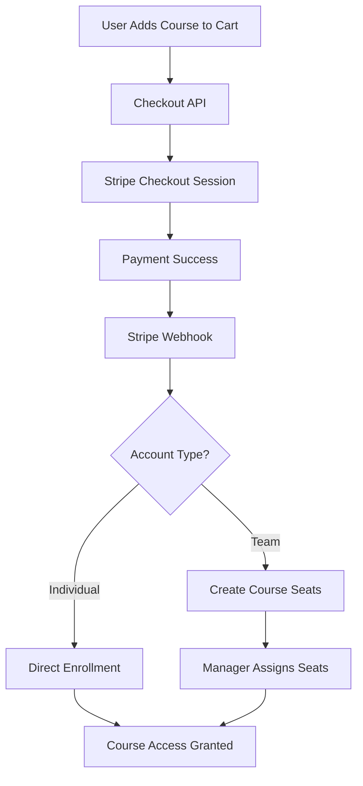

# Course Purchase Integration

This document explains how course purchases are integrated with Stripe and how access is granted after successful payment.

## Overview

The system supports two types of course purchases:

1. **Individual Purchases**: Direct enrollment upon payment
2. **Team Purchases**: Creates course seats that managers can assign to team members

## Architecture



## Key Components

### 1. Database Schema

#### Course Table Enhancement
- `billing_product_id`: Links courses to Stripe products
- `requires_purchase`: Computed field (price > 0)
- `price`: Course price in decimal format

#### Course Seats Table
- Tracks purchased seats per course per team account
- Enables bulk purchases for teams

### 2. Purchase Flow

#### Individual Purchase
1. User adds course to cart
2. Checkout creates Stripe session with `client_reference_id` = user's personal account ID
3. Payment success triggers webhook
4. Webhook calls `process_course_purchase` function
5. Function creates direct enrollment for the user

#### Team Purchase
1. Team manager adds courses to cart with quantity
2. Checkout creates Stripe session with `client_reference_id` = team account ID
3. Payment success triggers webhook
4. Webhook calls `process_course_purchase` function
5. Function creates/updates course seats for the team
6. Manager can invite team members via the seat management UI

### 3. Access Control

The `has_course_access` function checks if a user can access a course:

1. **Free courses**: Always accessible
2. **Paid courses**: Checks for:
   - Existing enrollment
   - Direct purchase (individual)
   - Available team seats

### 4. Implementation Files

#### Database Migration
`/apps/web/supabase/migrations/20250205_add_course_billing_integration.sql`
- Adds billing_product_id field
- Creates has_course_access function
- Creates process_course_purchase function

#### Webhook Handler
`/apps/web/app/api/billing/webhook/route.ts`
- Enhanced to handle course purchases
- Calls custom handler for checkout completion

#### Course Purchase Handler
`/apps/web/app/api/billing/webhook/_lib/course-purchase-handler.ts`
- Processes course purchases from webhook
- Handles both individual and team purchases

#### Checkout Route
`/apps/web/app/api/checkout/training/route.ts`
- Sets proper client_reference_id for account tracking
- Includes metadata for purchase type

#### Enrollment Action
`/apps/web/app/home/(user)/courses/_lib/server/course-enrollment-actions.ts`
- Updated to check purchase requirements
- Uses has_course_access function

### 5. Configuration

#### Billing Configuration
Update `/apps/web/config/billing.config.ts` with course products:

```typescript
{
  id: 'dot-hazmat', // Must match billing_product_id in courses table
  name: 'DOT HAZMAT Training',
  // ... price configuration
}
```

#### Course Mapping
Ensure courses in the database have the correct `billing_product_id`:

```sql
UPDATE public.courses 
SET billing_product_id = 'dot-hazmat'
WHERE sku = 'DOT-HAZMAT-001';
```

## Testing

### Test Individual Purchase
1. Log in as a regular user
2. Add a paid course to cart
3. Complete checkout
4. Verify direct enrollment after payment

### Test Team Purchase
1. Log in as a team owner
2. Add courses with quantity > 1
3. Complete checkout
4. Verify course seats are created
5. Test inviting team members

### Test Access Control
1. Try to enroll in a paid course without purchase
2. Verify error message about purchase requirement
3. Complete purchase and verify enrollment works

## Troubleshooting

### Common Issues

1. **Webhook not processing purchases**
   - Check Stripe webhook endpoint configuration
   - Verify webhook secret is correct
   - Check logs for webhook errors

2. **User can't access purchased course**
   - Verify client_reference_id is set correctly in checkout
   - Check if process_course_purchase function executed
   - Verify course has correct billing_product_id

3. **Team seats not showing**
   - Ensure purchase was made with team account
   - Check course_seats table for records
   - Verify team seat management page permissions

## Future Enhancements

1. **Email Notifications**
   - Send purchase confirmation emails
   - Notify users when invited to a course
   - Send completion certificates

2. **Bulk Operations**
   - Allow managers to invite multiple users at once
   - Bulk seat purchase discounts

3. **Reporting**
   - Purchase analytics dashboard
   - Seat utilization reports
   - Revenue tracking by course